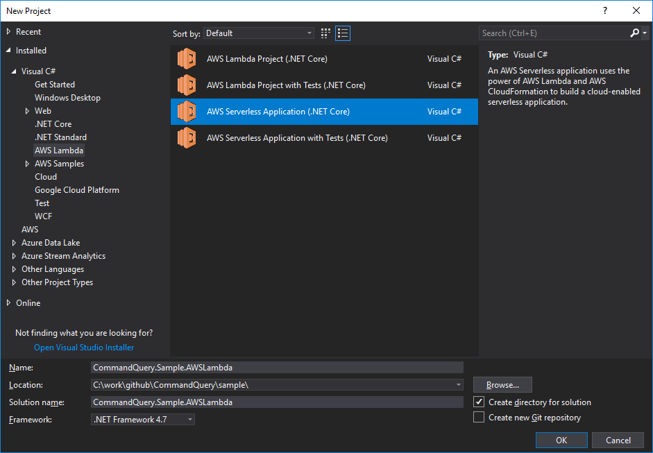
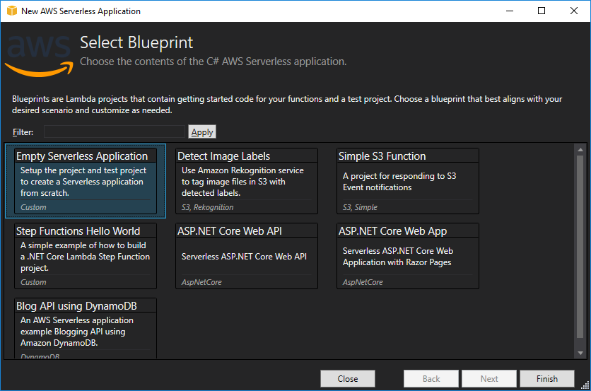

# CommandQuery.AWSLambda

> Command Query Separation for AWS Lambda ⚡

* Provides generic function support for commands and queries with *Amazon API Gateway*
* Enables APIs based on HTTP `POST` and `GET`

[ ](https://www.nuget.org/packages/CommandQuery.AWSLambda)

`PM>` `Install-Package CommandQuery.AWSLambda`

`>` `dotnet add package CommandQuery.AWSLambda`

## Sample Code

[`CommandQuery.Sample.AWSLambda`](/sample/CommandQuery.Sample.AWSLambda)

[`CommandQuery.Sample.Specs/AWSLambda`](/sample/CommandQuery.Sample.Specs/AWSLambda)

## Get Started

0. Install **AWS Toolkit for Visual Studio**
    * [https://aws.amazon.com/visualstudio/](https://aws.amazon.com/visualstudio/)
1. Create a new **AWS Serverless Application (.NET Core)** project
	* [Tutorial](https://docs.aws.amazon.com/toolkit-for-visual-studio/latest/user-guide/lambda-build-test-severless-app.html)
2. Install the `CommandQuery.AWSLambda` package from [NuGet](https://www.nuget.org/packages/CommandQuery.AWSLambda)
	* `PM>` `Install-Package CommandQuery.AWSLambda`
3. Create functions
	* For example named `Command` and `Query`
4. Create commands and command handlers
	* Implement `ICommand` and `ICommandHandler<in TCommand>`
5. Create queries and query handlers
	* Implement `IQuery<TResult>` and `IQueryHandler<in TQuery, TResult>`
6. Configure the serverless template



Choose the blueprint:

* Empty Serverless Application



## Commands

Add a `Command` function:

```csharp
using System.Threading.Tasks;
using Amazon.Lambda.Core;
using Amazon.Lambda.APIGatewayEvents;
using CommandQuery.AWSLambda;
using CommandQuery.DependencyInjection;
using CommandQuery.Sample.Commands;
using Microsoft.Extensions.DependencyInjection;

[assembly: LambdaSerializer(typeof(Amazon.Lambda.Serialization.Json.JsonSerializer))]

namespace CommandQuery.Sample.AWSLambda
{
    public class Command
    {
        private static readonly CommandFunction Func = new CommandFunction(typeof(FooCommand).Assembly.GetCommandProcessor(GetServiceCollection()));

        public async Task<APIGatewayProxyResponse> Handle(APIGatewayProxyRequest request, ILambdaContext context)
        {
            return await Func.Handle(request.PathParameters["commandName"], request, context);
        }

        private static IServiceCollection GetServiceCollection()
        {
            var services = new ServiceCollection();
            // Add handler dependencies
            services.AddTransient<ICultureService, CultureService>();

            return services;
        }
    }
}
```

* The function is requested via HTTP `POST` with the Content-Type `application/json` in the header.
* The name of the command is the slug of the URL.
* The command itself is provided as JSON in the body.
* If the command succeeds; the response is empty with the HTTP status code `200`.
* If the command fails; the response is an error message with the HTTP status code `400` or `500`.

## Queries

Add a `Query` function:

```csharp
using System.Threading.Tasks;
using Amazon.Lambda.Core;
using Amazon.Lambda.APIGatewayEvents;
using CommandQuery.AWSLambda;
using CommandQuery.DependencyInjection;
using CommandQuery.Sample.Queries;
using Microsoft.Extensions.DependencyInjection;

namespace CommandQuery.Sample.AWSLambda
{
    public class Query
    {
        private static readonly QueryFunction Func = new QueryFunction(typeof(BarQuery).Assembly.GetQueryProcessor(GetServiceCollection()));

        public async Task<APIGatewayProxyResponse> Handle(APIGatewayProxyRequest request, ILambdaContext context)
        {
            return await Func.Handle(request.PathParameters["queryName"], request, context);
        }

        private static IServiceCollection GetServiceCollection()
        {
            var services = new ServiceCollection();
            // Add handler dependencies
            services.AddTransient<IDateTimeProxy, DateTimeProxy>();

            return services;
        }
    }
}
```

* The function is requested via:
    * HTTP `POST` with the Content-Type `application/json` in the header and the query itself as JSON in the body
    * HTTP `GET` and the query itself as query string parameters in the URL
* The name of the query is the slug of the URL.
* If the query succeeds; the response is the result as JSON with the HTTP status code `200`.
* If the query fails; the response is an error message with the HTTP status code `400` or `500`.

## Configuration

Configuration in `serverless.template`:

```json
{
  "AWSTemplateFormatVersion" : "2010-09-09",
  "Transform" : "AWS::Serverless-2016-10-31",
  "Description" : "An AWS Serverless Application.",
  "Resources" : {
    "Command" : {
      "Type" : "AWS::Serverless::Function",
      "Properties": {
        "Handler": "CommandQuery.Sample.AWSLambda::CommandQuery.Sample.AWSLambda.Command::Handle",
        "Runtime": "dotnetcore2.0",
        "CodeUri": "",
        "MemorySize": 256,
        "Timeout": 30,
        "Role": null,
        "Policies": [ "AWSLambdaBasicExecutionRole" ],
        "Events": {
          "PostResource": {
            "Type": "Api",
            "Properties": {
              "Path": "/command/{commandName}",
              "Method": "POST"
            }
          }
        }
      }
    },
    "Query" : {
      "Type" : "AWS::Serverless::Function",
      "Properties": {
        "Handler": "CommandQuery.Sample.AWSLambda::CommandQuery.Sample.AWSLambda.Query::Handle",
        "Runtime": "dotnetcore2.0",
        "CodeUri": "",
        "MemorySize": 256,
        "Timeout": 30,
        "Role": null,
        "Policies": [ "AWSLambdaBasicExecutionRole" ],
        "Events": {
          "GetResource": {
            "Type": "Api",
            "Properties": {
              "Path": "/query/{queryName}",
			  "Method": "GET"
            }
          },
          "PostResource": {
            "Type": "Api",
            "Properties": {
              "Path": "/query/{queryName}",
			  "Method": "POST"
            }
          }
        }
      }
    }
  },
  "Outputs" : {
    "ApiURL" : {
        "Description" : "API endpoint URL for Prod environment",
        "Value" : { "Fn::Sub" : "https://${ServerlessRestApi}.execute-api.${AWS::Region}.amazonaws.com/Prod/" }
    }
  }
}
```

## Testing

Test commands:

```csharp
using Amazon.Lambda.APIGatewayEvents;
using CommandQuery.Sample.AWSLambda;
using Machine.Specifications;

namespace CommandQuery.Sample.Specs.AWSLambda
{
    public class CommandSpecs
    {
        [Subject(typeof(Command))]
        public class when_using_the_real_function
        {
            It should_work = () =>
            {
                var request = GetRequest("{ 'Value': 'Foo' }");
                var context = new FakeLambdaContext();

                var result = new Command().Handle(request.CommandName("FooCommand"), context).Result;

                result.ShouldNotBeNull();
            };

            It should_handle_errors = () =>
            {
                var request = GetRequest("{ 'Value': 'Foo' }");
                var context = new FakeLambdaContext();

                var result = new Command().Handle(request.CommandName("FailCommand"), context).Result;

                result.ShouldBeError("The command type 'FailCommand' could not be found");
            };

            static APIGatewayProxyRequest GetRequest(string content) => new APIGatewayProxyRequest { Body = content };
        }
    }
}
```

Test queries:

```csharp
using System.Collections.Generic;
using Amazon.Lambda.APIGatewayEvents;
using Amazon.Lambda.Core;
using CommandQuery.Sample.AWSLambda;
using CommandQuery.Sample.Queries;
using Machine.Specifications;

namespace CommandQuery.Sample.Specs.AWSLambda
{
    public class QuerySpecs
    {
        [Subject(typeof(Query))]
        public class when_using_the_real_function
        {
            public class method_Post
            {
                Establish context = () =>
                {
                    Subject = new Query();
                    Request = GetRequest("POST", content: "{ 'Id': 1 }");
                    Context = new FakeLambdaContext();
                };

                It should_work = () =>
                {
                    var result = Subject.Handle(Request.QueryName("BarQuery"), Context).Result;
                    var value = result.As<Bar>();

                    value.Id.ShouldEqual(1);
                    value.Value.ShouldNotBeEmpty();
                };

                It should_handle_errors = () =>
                {
                    var result = Subject.Handle(Request.QueryName("FailQuery"), Context).Result;

                    result.ShouldBeError("The query type 'FailQuery' could not be found");
                };
            }

            public class method_Get
            {
                Establish context = () =>
                {
                    Subject = new Query();
                    Request = GetRequest("GET", query: new Dictionary<string, string> { { "Id", "1" } });
                    Context = new FakeLambdaContext();
                };

                It should_work = () =>
                {
                    var result = Subject.Handle(Request.QueryName("BarQuery"), Context).Result;
                    var value = result.As<Bar>();

                    value.Id.ShouldEqual(1);
                    value.Value.ShouldNotBeEmpty();
                };

                It should_handle_errors = () =>
                {
                    var result = Subject.Handle(Request.QueryName("FailQuery"), Context).Result;

                    result.ShouldBeError("The query type 'FailQuery' could not be found");
                };
            }

            static Query Subject;
            static APIGatewayProxyRequest Request;
            static ILambdaContext Context;

            static APIGatewayProxyRequest GetRequest(string method, string content = null, Dictionary<string, string> query = null)
            {
                var request = new APIGatewayProxyRequest
                {
                    HttpMethod = method,
                    Body = content,
                    QueryStringParameters = query
                };

                return request;
            }
        }
    }
}
```

Helpers:

```csharp
using Amazon.Lambda.APIGatewayEvents;
using Machine.Specifications;
using Newtonsoft.Json;

namespace CommandQuery.Sample.Specs.AWSLambda
{
    public static class ShouldExtensions
    {
        public static void ShouldBeError(this APIGatewayProxyResponse result, string message)
        {
            result.ShouldNotBeNull();
            result.StatusCode.ShouldNotEqual(200);
            var value = JsonConvert.DeserializeObject<Error>(result.Body);
            value.ShouldNotBeNull();
            value.Message.ShouldEqual(message);
        }
    }
}
```
