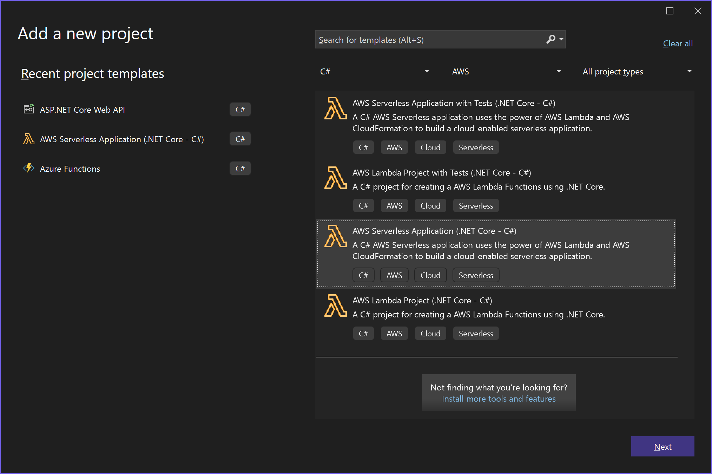
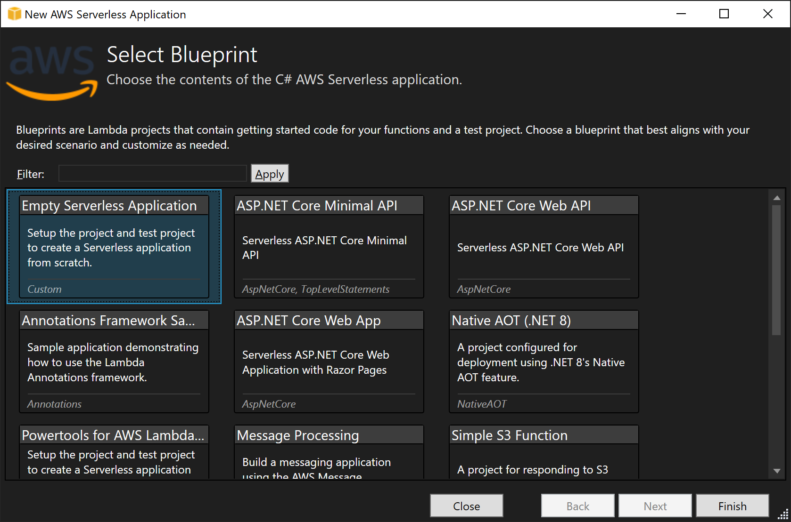

### CommandQuery.AWSLambda ⚡

[](https://github.com/hlaueriksson/CommandQuery/actions/workflows/build.yml) [](https://codefactor.io/repository/github/hlaueriksson/commandquery)

> Command Query Separation for AWS Lambda

* Provides generic function support for commands and queries with *Amazon API Gateway*
* Enables APIs based on HTTP `POST` and `GET`

#### Get Started

0. Install **AWS Toolkit for Visual Studio**
   * [https://aws.amazon.com/visualstudio/](https://aws.amazon.com/visualstudio/)
1. Create a new **AWS Serverless Application (.NET Core)** project
   * [Tutorial](https://docs.aws.amazon.com/toolkit-for-visual-studio/latest/user-guide/lambda-build-test-severless-app.html)
2. Install the `CommandQuery.AWSLambda` package from [NuGet](https://www.nuget.org/packages/CommandQuery.AWSLambda)
   * `PM>` `Install-Package CommandQuery.AWSLambda`
3. Create functions
   * Preferably named `Command` and `Query`
4. Create commands and command handlers
   * Implement `ICommand` and `ICommandHandler<in TCommand>`
   * Or `ICommand<TResult>` and `ICommandHandler<in TCommand, TResult>`
5. Create queries and query handlers
   * Implement `IQuery<TResult>` and `IQueryHandler<in TQuery, TResult>`
6. Configure the serverless template



Choose:

* Empty Serverless Application



#### Commands

```cs
using System.Text.Json;
using System.Threading.Tasks;
using Amazon.Lambda.Core;
using Amazon.Lambda.APIGatewayEvents;
using CommandQuery.AWSLambda;
using CommandQuery.Sample.Contracts.Commands;
using CommandQuery.Sample.Handlers;
using CommandQuery.Sample.Handlers.Commands;
using Microsoft.Extensions.DependencyInjection;

[assembly: LambdaSerializer(typeof(Amazon.Lambda.Serialization.SystemTextJson.DefaultLambdaJsonSerializer))]

namespace CommandQuery.Sample.AWSLambda
{
    public class Command
    {
        private static readonly ICommandFunction _commandFunction = GetCommandFunction();

        public async Task<APIGatewayProxyResponse> Handle(APIGatewayProxyRequest request, ILambdaContext context)
        {
            return await _commandFunction.HandleAsync(request.PathParameters["commandName"], request, context.Logger);
        }

        private static ICommandFunction GetCommandFunction()
        {
            var services = new ServiceCollection();
            //services.AddSingleton(new JsonSerializerOptions(JsonSerializerDefaults.Web));
            services.AddCommandFunction(typeof(FooCommandHandler).Assembly, typeof(FooCommand).Assembly);
            // Add handler dependencies
            services.AddTransient<ICultureService, CultureService>();

            var serviceProvider = services.BuildServiceProvider();
            // Validation
            serviceProvider.GetService<ICommandProcessor>().AssertConfigurationIsValid();
            return serviceProvider.GetService<ICommandFunction>();
        }
    }
}
```

* The function is requested via HTTP `POST` with the Content-Type `application/json` in the header.
* The name of the command is the slug of the URL.
* The command itself is provided as JSON in the body.
* If the command succeeds; the response is empty with the HTTP status code `200`.
* If the command fails; the response is an error message with the HTTP status code `400` or `500`.

Commands with result:

* If the command succeeds; the response is the result as JSON with the HTTP status code `200`.

#### Queries

```cs
using System.Text.Json;
using System.Threading.Tasks;
using Amazon.Lambda.Core;
using Amazon.Lambda.APIGatewayEvents;
using CommandQuery.AWSLambda;
using CommandQuery.Sample.Contracts.Queries;
using CommandQuery.Sample.Handlers;
using CommandQuery.Sample.Handlers.Queries;
using Microsoft.Extensions.DependencyInjection;

namespace CommandQuery.Sample.AWSLambda
{
    public class Query
    {
        private static readonly IQueryFunction _queryFunction = GetQueryFunction();

        public async Task<APIGatewayProxyResponse> Handle(APIGatewayProxyRequest request, ILambdaContext context)
        {
            return await _queryFunction.HandleAsync(request.PathParameters["queryName"], request, context.Logger);
        }

        private static IQueryFunction GetQueryFunction()
        {
            var services = new ServiceCollection();
            //services.AddSingleton(new JsonSerializerOptions(JsonSerializerDefaults.Web));
            services.AddQueryFunction(typeof(BarQueryHandler).Assembly, typeof(BarQuery).Assembly);
            // Add handler dependencies
            services.AddTransient<IDateTimeProxy, DateTimeProxy>();

            var serviceProvider = services.BuildServiceProvider();
            // Validation
            serviceProvider.GetService<IQueryProcessor>().AssertConfigurationIsValid();
            return serviceProvider.GetService<IQueryFunction>();
        }
    }
}
```

* The function is requested via:
  * HTTP `POST` with the Content-Type `application/json` in the header and the query itself as JSON in the body
  * HTTP `GET` and the query itself as query string parameters in the URL
* The name of the query is the slug of the URL.
* If the query succeeds; the response is the result as JSON with the HTTP status code `200`.
* If the query fails; the response is an error message with the HTTP status code `400` or `500`.

#### Configuration

Configuration in `serverless.template`:

```json
{
  "AWSTemplateFormatVersion": "2010-09-09",
  "Transform": "AWS::Serverless-2016-10-31",
  "Description": "An AWS Serverless Application.",
  "Resources": {
    "Command": {
      "Type": "AWS::Serverless::Function",
      "Properties": {
        "Handler": "CommandQuery.Sample.AWSLambda::CommandQuery.Sample.AWSLambda.Command::Handle",
        "Runtime": "dotnetcore3.1",
        "CodeUri": "",
        "MemorySize": 256,
        "Timeout": 30,
        "Role": null,
        "Policies": [
          "AWSLambdaBasicExecutionRole"
        ],
        "Events": {
          "PostResource": {
            "Type": "Api",
            "Properties": {
              "Path": "/command/{commandName}",
              "Method": "POST"
            }
          }
        }
      }
    },
    "Query": {
      "Type": "AWS::Serverless::Function",
      "Properties": {
        "Handler": "CommandQuery.Sample.AWSLambda::CommandQuery.Sample.AWSLambda.Query::Handle",
        "Runtime": "dotnetcore3.1",
        "CodeUri": "",
        "MemorySize": 256,
        "Timeout": 30,
        "Role": null,
        "Policies": [
          "AWSLambdaBasicExecutionRole"
        ],
        "Events": {
          "GetResource": {
            "Type": "Api",
            "Properties": {
              "Path": "/query/{queryName}",
              "Method": "GET"
            }
          },
          "PostResource": {
            "Type": "Api",
            "Properties": {
              "Path": "/query/{queryName}",
              "Method": "POST"
            }
          }
        }
      }
    }
  },
  "Outputs": {
    "ApiURL": {
      "Description": "API endpoint URL for Prod environment",
      "Value": {
        "Fn::Sub": "https://${ServerlessRestApi}.execute-api.${AWS::Region}.amazonaws.com/Prod/"
      }
    }
  }
}
```

#### Testing

```cs
using System.Collections.Generic;
using System.Threading.Tasks;
using Amazon.Lambda.APIGatewayEvents;
using Amazon.Lambda.Core;
using CommandQuery.Sample.Contracts.Queries;
using FluentAssertions;
using NUnit.Framework;

namespace CommandQuery.Sample.AWSLambda.Tests
{
    public class QueryTests
    {
        public class when_using_the_real_function_via_Post
        {
            [SetUp]
            public void SetUp()
            {
                Subject = new Query();
                Request = GetRequest("POST", content: "{ \"Id\": 1 }");
                Context = new FakeLambdaContext();
            }

            [Test]
            public async Task should_work()
            {
                var result = await Subject.Handle(Request.QueryName("BarQuery"), Context);
                var value = result.As<Bar>();

                value.Id.Should().Be(1);
                value.Value.Should().NotBeEmpty();
            }

            [Test]
            public async Task should_handle_errors()
            {
                var result = await Subject.Handle(Request.QueryName("FailQuery"), Context);

                result.ShouldBeError("The query type 'FailQuery' could not be found");
            }

            Query Subject;
            APIGatewayProxyRequest Request;
            ILambdaContext Context;
        }

        public class when_using_the_real_function_via_Get
        {
            [SetUp]
            public void SetUp()
            {
                Subject = new Query();
                Request = GetRequest("GET", query: new Dictionary<string, IList<string>> { { "Id", new List<string> { "1" } } });
                Context = new FakeLambdaContext();
            }

            [Test]
            public async Task should_work()
            {
                var result = await Subject.Handle(Request.QueryName("BarQuery"), Context);
                var value = result.As<Bar>();

                value.Id.Should().Be(1);
                value.Value.Should().NotBeEmpty();
            }

            [Test]
            public async Task should_handle_errors()
            {
                var result = await Subject.Handle(Request.QueryName("FailQuery"), Context);

                result.ShouldBeError("The query type 'FailQuery' could not be found");
            }

            Query Subject;
            APIGatewayProxyRequest Request;
            ILambdaContext Context;
        }

        static APIGatewayProxyRequest GetRequest(string method, string content = null, Dictionary<string, IList<string>> query = null)
        {
            var request = new APIGatewayProxyRequest
            {
                HttpMethod = method,
                Body = content,
                MultiValueQueryStringParameters = query
            };

            return request;
        }
    }
}
```

#### Samples

* [CommandQuery.Sample.AWSLambda](https://github.com/hlaueriksson/CommandQuery/tree/master/samples/CommandQuery.Sample.AWSLambda)
* [CommandQuery.Sample.AWSLambda.Tests](https://github.com/hlaueriksson/CommandQuery/tree/master/samples/CommandQuery.Sample.AWSLambda.Tests)
