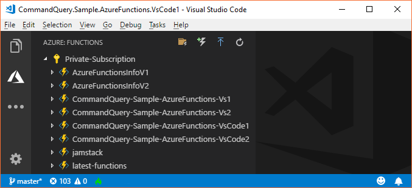
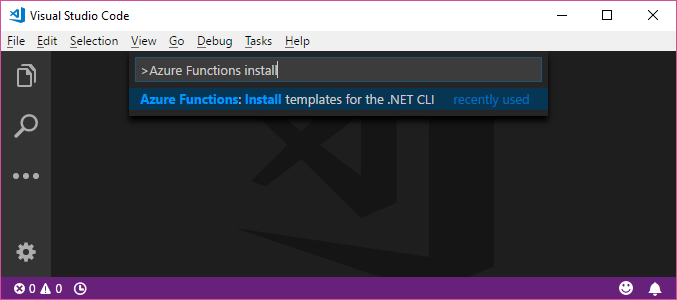
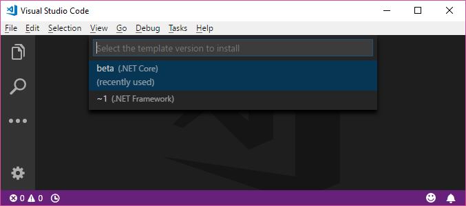

# CommandQuery.AzureFunctions

> Command Query Separation for Azure Functions ⚡

* Provides generic function support for commands and queries with *HTTPTriggers*
* Enables APIs based on HTTP `POST` and `GET`

[ ](https://www.nuget.org/packages/CommandQuery.AzureFunctions)

`PM>` `Install-Package CommandQuery.AzureFunctions`

`>` `dotnet add package CommandQuery.AzureFunctions`

## Sample Code

* *Visual Studio*:
    * [`CommandQuery.Sample.AzureFunctions.Vs1`](/sample/CommandQuery.Sample.AzureFunctions.Vs1) - Azure Functions v1 (.NET Framework)
    * [`CommandQuery.Sample.AzureFunctions.Vs2`](/sample/CommandQuery.Sample.AzureFunctions.Vs2) - Azure Functions v2 (.NET Core)
    * [`CommandQuery.Sample.Specs/AzureFunctions.Vs1`](/sample/CommandQuery.Sample.Specs/AzureFunctions.Vs1)
    * [`CommandQuery.Sample.Specs/AzureFunctions.Vs2`](/sample/CommandQuery.Sample.Specs/AzureFunctions.Vs2)
* *Visual Studio Code*:
    * [`CommandQuery.Sample.AzureFunctions.VsCode1`](/sample/CommandQuery.Sample.AzureFunctions.VsCode1) - Azure Functions v1 (.NET Framework)
    * [`CommandQuery.Sample.AzureFunctions.VsCode2`](/sample/CommandQuery.Sample.AzureFunctions.VsCode2) - Azure Functions v2 (.NET Core)

## Get Started in *Visual Studio*

0. Install **Azure Functions and Web Jobs Tools**
    * [https://marketplace.visualstudio.com/items?itemName=VisualStudioWebandAzureTools.AzureFunctionsandWebJobsTools](https://marketplace.visualstudio.com/items?itemName=VisualStudioWebandAzureTools.AzureFunctionsandWebJobsTools)
1. Create a new **Azure Functions** project
	* [Tutorial](https://docs.microsoft.com/en-us/azure/azure-functions/functions-create-your-first-function-visual-studio)
2. Install the `CommandQuery.AzureFunctions` package from [NuGet](https://www.nuget.org/packages/CommandQuery.AzureFunctions/)
	* `PM>` `Install-Package CommandQuery.AzureFunctions`
3. Create functions
	* For example named `Command` and `Query`
4. Create commands and command handlers
	* Implement `ICommand` and `ICommandHandler<in TCommand>`
5. Create queries and query handlers
	* Implement `IQuery<TResult>` and `IQueryHandler<in TQuery, TResult>`


When you create a new project in Visual Studio you need to choose the runtime:

* Azure Functions v1 (.NET Framework)
* Azure Functions v2 (.NET Core)


## Get Started in *Visual Studio Code*

0. Install **Azure Functions**
    * [https://marketplace.visualstudio.com/items?itemName=ms-azuretools.vscode-azurefunctions](https://marketplace.visualstudio.com/items?itemName=ms-azuretools.vscode-azurefunctions)
1. Create a new **Azure Functions** project
	* [Tutorial](https://code.visualstudio.com/tutorials/functions-extension/getting-started)
2. Install the `CommandQuery.AzureFunctions` package from [NuGet](https://www.nuget.org/packages/CommandQuery.AzureFunctions/)
	* `dotnet add package CommandQuery.AzureFunctions`
3. Create functions
	* For example named `Command` and `Query`
4. Create commands and command handlers
	* Implement `ICommand` and `ICommandHandler<in TCommand>`
5. Create queries and query handlers
	* Implement `IQuery<TResult>` and `IQueryHandler<in TQuery, TResult>`



Before you create a new project in Visual Studio Code you need to install the runtime:

* Azure Functions v1 (.NET Framework)
    * `npm i -g azure-functions-core-tools`
* Azure Functions v2 (.NET Core)
    * `npm i -g azure-functions-core-tools@core --unsafe-perm true`

And install the _.NET Templates for Azure Functions_:




## Commands

Add a `Command` function in *Azure Functions v1 (.NET Framework)*:

```csharp
using System.Net.Http;
using System.Threading.Tasks;
using CommandQuery.AzureFunctions;
using CommandQuery.DependencyInjection;
using CommandQuery.Sample.Commands;
using Microsoft.Azure.WebJobs;
using Microsoft.Azure.WebJobs.Extensions.Http;
using Microsoft.Azure.WebJobs.Host;
using Microsoft.Extensions.DependencyInjection;

namespace CommandQuery.Sample.AzureFunctions.Vs1
{
    public static class Command
    {
        private static readonly CommandFunction Func = new CommandFunction(typeof(FooCommand).Assembly.GetCommandProcessor(GetServiceCollection()));

        [FunctionName("Command")]
        public static async Task<HttpResponseMessage> Run([HttpTrigger(AuthorizationLevel.Anonymous, "post", Route = "command/{commandName}")] HttpRequestMessage req, TraceWriter log, string commandName)
        {
            return await Func.Handle(commandName, req, log);
        }

        private static IServiceCollection GetServiceCollection()
        {
            var services = new ServiceCollection();
            // Add handler dependencies
            services.AddTransient<ICultureService, CultureService>();

            return services;
        }
    }
}
```

Add a `Command` function in *Azure Functions v2 (.NET Core)*:

```csharp
using System.Threading.Tasks;
using CommandQuery.AzureFunctions;
using CommandQuery.DependencyInjection;
using CommandQuery.Sample.Commands;
using Microsoft.AspNetCore.Http;
using Microsoft.AspNetCore.Mvc;
using Microsoft.Azure.WebJobs;
using Microsoft.Azure.WebJobs.Extensions.Http;
using Microsoft.Azure.WebJobs.Host;
using Microsoft.Extensions.DependencyInjection;

namespace CommandQuery.Sample.AzureFunctions.Vs2
{
    public static class Command
    {
        private static readonly CommandFunction Func = new CommandFunction(typeof(FooCommand).Assembly.GetCommandProcessor(GetServiceCollection()));

        [FunctionName("Command")]
        public static async Task<IActionResult> Run([HttpTrigger(AuthorizationLevel.Anonymous, "post", Route = "command/{commandName}")] HttpRequest req, TraceWriter log, string commandName)
        {
            return await Func.Handle(commandName, req, log);
        }

        private static IServiceCollection GetServiceCollection()
        {
            var services = new ServiceCollection();
            // Add handler dependencies
            services.AddTransient<ICultureService, CultureService>();

            return services;
        }
    }
}
```

* The function is requested via HTTP `POST` with the Content-Type `application/json` in the header.
* The name of the command is the slug of the URL.
* The command itself is provided as JSON in the body.
* If the command succeeds; the response is empty with the HTTP status code `200`.
* If the command fails; the response is an error message with the HTTP status code `400` or `500`.

Example of a command request via [curl](https://curl.haxx.se):

`curl -X POST -d "{'Value':'sv-SE'}" http://localhost:7071/api/command/FooCommand --header "Content-Type:application/json"`

## Queries

Add a `Query` function in *Azure Functions v1 (.NET Framework)*:

```csharp
using System.Net.Http;
using System.Threading.Tasks;
using CommandQuery.AzureFunctions;
using CommandQuery.DependencyInjection;
using CommandQuery.Sample.Queries;
using Microsoft.Azure.WebJobs;
using Microsoft.Azure.WebJobs.Extensions.Http;
using Microsoft.Azure.WebJobs.Host;
using Microsoft.Extensions.DependencyInjection;

namespace CommandQuery.Sample.AzureFunctions.Vs1
{
    public static class Query
    {
        private static readonly QueryFunction Func = new QueryFunction(typeof(BarQuery).Assembly.GetQueryProcessor(GetServiceCollection()));

        [FunctionName("Query")]
        public static async Task<HttpResponseMessage> Run([HttpTrigger(AuthorizationLevel.Anonymous, "get", "post", Route = "query/{queryName}")] HttpRequestMessage req, TraceWriter log, string queryName)
        {
            return await Func.Handle(queryName, req, log);
        }

        private static IServiceCollection GetServiceCollection()
        {
            var services = new ServiceCollection();
            // Add handler dependencies
            services.AddTransient<IDateTimeProxy, DateTimeProxy>();

            return services;
        }
    }
}
```

Add a `Query` function in *Azure Functions v2 (.NET Core)*:

```csharp
using System.Threading.Tasks;
using CommandQuery.AzureFunctions;
using CommandQuery.DependencyInjection;
using CommandQuery.Sample.Queries;
using Microsoft.AspNetCore.Http;
using Microsoft.AspNetCore.Mvc;
using Microsoft.Azure.WebJobs;
using Microsoft.Azure.WebJobs.Extensions.Http;
using Microsoft.Azure.WebJobs.Host;
using Microsoft.Extensions.DependencyInjection;

namespace CommandQuery.Sample.AzureFunctions.Vs2
{
    public static class Query
    {
        private static readonly QueryFunction Func = new QueryFunction(typeof(BarQuery).Assembly.GetQueryProcessor(GetServiceCollection()));

        [FunctionName("Query")]
        public static async Task<IActionResult> Run([HttpTrigger(AuthorizationLevel.Anonymous, "get", "post", Route = "query/{queryName}")] HttpRequest req, TraceWriter log, string queryName)
        {
            return await Func.Handle(queryName, req, log);
        }

        private static IServiceCollection GetServiceCollection()
        {
            var services = new ServiceCollection();
            // Add handler dependencies
            services.AddTransient<IDateTimeProxy, DateTimeProxy>();

            return services;
        }
    }
}
```

* The function is requested via:
    * HTTP `POST` with the Content-Type `application/json` in the header and the query itself as JSON in the body
    * HTTP `GET` and the query itself as query string parameters in the URL
* The name of the query is the slug of the URL.
* If the query succeeds; the response is the result as JSON with the HTTP status code `200`.
* If the query fails; the response is an error message with the HTTP status code `400` or `500`.

Example of query requests via [curl](https://curl.haxx.se):

`curl -X POST -d "{'Id':1}" http://localhost:7071/api/query/BarQuery --header "Content-Type:application/json"`

`curl -X GET http://localhost:7071/api/query/BarQuery?Id=1`

## Testing

Test commands:

```csharp
using System.IO;
using CommandQuery.Sample.AzureFunctions.Vs2;
using Machine.Specifications;
using Microsoft.AspNetCore.Http;
using Microsoft.AspNetCore.Http.Features;
using Microsoft.AspNetCore.Http.Internal;
using Microsoft.AspNetCore.Mvc;

namespace CommandQuery.Sample.Specs.AzureFunctions.Vs2
{
    public class CommandSpecs
    {
        [Subject(typeof(Command))]
        public class when_using_the_real_function
        {
            It should_work = () =>
            {
                var req = GetHttpRequest("{ 'Value': 'Foo' }");
                var log = new FakeTraceWriter();

                var result = Command.Run(req, log, "FooCommand").Result as EmptyResult;

                result.ShouldNotBeNull();
            };

            It should_handle_errors = () =>
            {
                var req = GetHttpRequest("{ 'Value': 'Foo' }");
                var log = new FakeTraceWriter();

                var result = Command.Run(req, log, "FailCommand").Result as BadRequestObjectResult;

                result.ShouldBeError("The command type 'FailCommand' could not be found");
            };

            static DefaultHttpRequest GetHttpRequest(string content)
            {
                var httpContext = new DefaultHttpContext();
                httpContext.Features.Get<IHttpRequestFeature>().Body = new MemoryStream(System.Text.Encoding.UTF8.GetBytes(content));

                return new DefaultHttpRequest(httpContext);
            }
        }
    }
}
```

Test queries:

```csharp
using System.Collections.Generic;
using System.IO;
using CommandQuery.Sample.AzureFunctions.Vs2;
using CommandQuery.Sample.Queries;
using Machine.Specifications;
using Microsoft.AspNetCore.Http;
using Microsoft.AspNetCore.Http.Features;
using Microsoft.AspNetCore.Http.Internal;
using Microsoft.AspNetCore.Mvc;
using Microsoft.AspNetCore.WebUtilities;

namespace CommandQuery.Sample.Specs.AzureFunctions.Vs2
{
    public class QuerySpecs
    {
        [Subject(typeof(Query))]
        public class when_using_the_real_function
        {
            public class method_Post
            {
                Establish context = () =>
                {
                    Req = GetHttpRequest("POST", content: "{ 'Id': 1 }");
                    Log = new FakeTraceWriter();
                };

                It should_work = () =>
                {
                    var result = Query.Run(Req, Log, "BarQuery").Result as OkObjectResult;
                    var value = result.Value as Bar;

                    value.Id.ShouldEqual(1);
                    value.Value.ShouldNotBeEmpty();
                };

                It should_handle_errors = () =>
                {
                    var result = Query.Run(Req, Log, "FailQuery").Result as BadRequestObjectResult;

                    result.ShouldBeError("The query type 'FailQuery' could not be found");
                };
            }

            public class method_Get
            {
                Establish context = () =>
                {
                    Req = GetHttpRequest("GET", query: new Dictionary<string, string> { { "Id", "1" } });
                    Log = new FakeTraceWriter();
                };

                It should_work = () =>
                {
                    var result = Query.Run(Req, Log, "BarQuery").Result as OkObjectResult;
                    var value = result.Value as Bar;

                    value.Id.ShouldEqual(1);
                    value.Value.ShouldNotBeEmpty();
                };

                It should_handle_errors = () =>
                {
                    var result = Query.Run(Req, Log, "FailQuery").Result as BadRequestObjectResult;

                    result.ShouldBeError("The query type 'FailQuery' could not be found");
                };
            }

            static DefaultHttpRequest Req;
            static FakeTraceWriter Log;

            static DefaultHttpRequest GetHttpRequest(string method, string content = null, Dictionary<string, string> query = null)
            {
                var httpContext = new DefaultHttpContext();

                if (content != null)
                {
                    httpContext.Features.Get<IHttpRequestFeature>().Body = new MemoryStream(System.Text.Encoding.UTF8.GetBytes(content));
                }

                var request = new DefaultHttpRequest(httpContext) { Method = method };

                if (query != null)
                {
                    request.QueryString = new QueryString(QueryHelpers.AddQueryString("", query));
                }

                return request;
            }
        }
    }
}
```

Helpers:

```csharp
using Machine.Specifications;
using Microsoft.AspNetCore.Mvc;

namespace CommandQuery.Sample.Specs.AzureFunctions.Vs2
{
    public static class ShouldExtensions
    {
        public static void ShouldBeError(this ObjectResult result, string message)
        {
            result.ShouldNotBeNull();
            result.StatusCode.ShouldNotEqual(200);
            var value = result.Value as Error;
            value.ShouldNotBeNull();
            value.Message.ShouldEqual(message);
        }
    }
}
```
