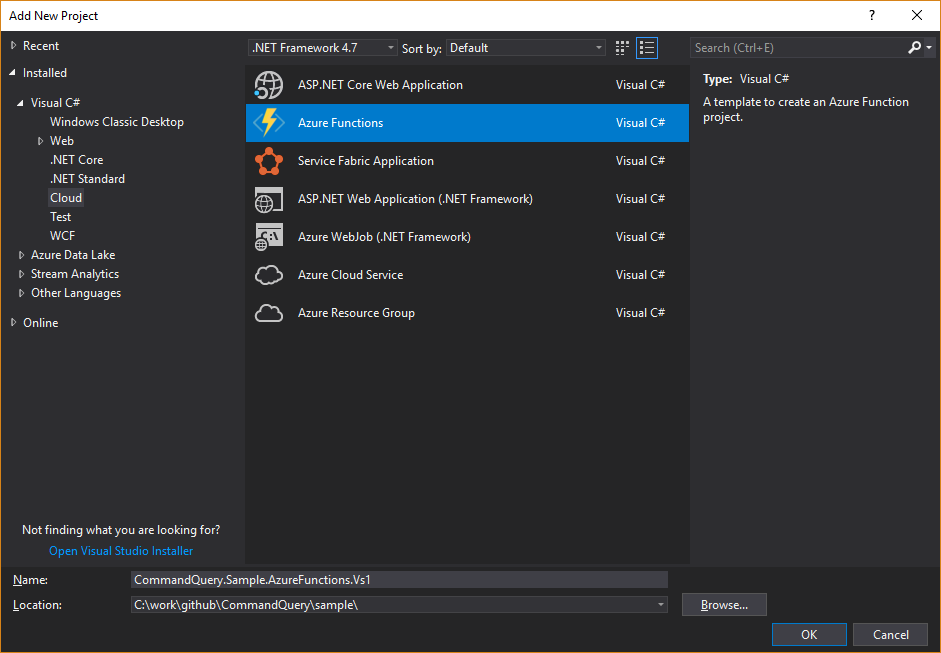
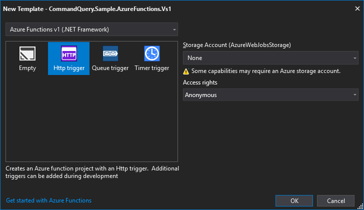
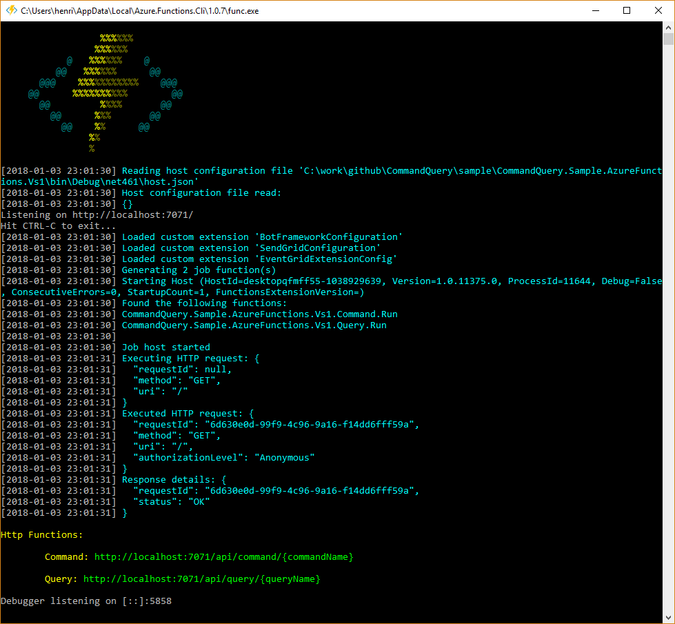
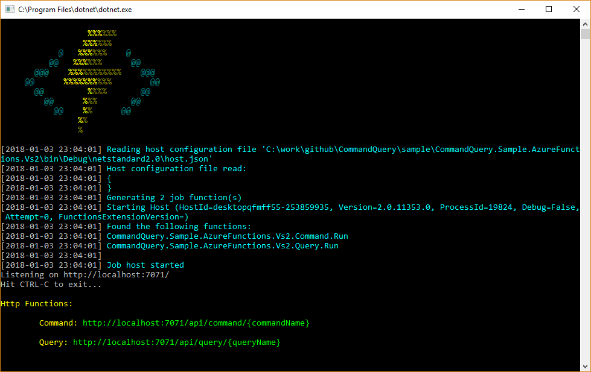

# CommandQuery

[](https://ci.appveyor.com/project/hlaueriksson/commandquery)
[](https://www.nuget.org/packages/CommandQuery)

## Introduction

Command Query Separation (CQS) for ASP.NET Core and Azure Functions

* Build services and functions that separate the responsibility of commands and queries
* Focus on implementing the handlers for commands and queries
* Make use of ASP.NET Core and Azure Functions to create APIs with CQS

Commands and Queries:
* [Commands](#commands)
* [Queries](#queries)

ASP.NET Core:
* [CommandQuery.AspNetCore](#commandqueryaspnetcore)

Azure Functions:
* [CommandQuery.AzureFunctions](#commandqueryazurefunctions)

Testing:
* [CommandQuery.AspNetCore](#commandqueryaspnetcore-1)
* [CommandQuery.AzureFunctions](#commandqueryazurefunctions-1)

Inspired by:
* https://cuttingedge.it/blogs/steven/pivot/entry.php?id=91
* https://cuttingedge.it/blogs/steven/pivot/entry.php?id=92

[Command Query Separation](http://martinfowler.com/bliki/CommandQuerySeparation.html) in a nutshell:

* Commands
	* Writes (Create, Update, Delete) data
* Queries
	* Reads and returns data

## Commands

> Commands: Change the state of a system but do not return a value.
>
>  - [Martin Fowler](http://martinfowler.com/bliki/CommandQuerySeparation.html)

Download from NuGet: https://www.nuget.org/packages/CommandQuery/

Example code: [`CommandQuery.Sample`](/sample/CommandQuery.Sample)

Create a `Command` and `CommandHandler`:

```csharp
using System.Threading.Tasks;

namespace CommandQuery.Sample.Commands
{
    public class FooCommand : ICommand
    {
        public string Value { get; set; }
    }

    public class FooCommandHandler : ICommandHandler<FooCommand>
    {
        public async Task HandleAsync(FooCommand command)
        {
            // TODO: do some real command stuff

            await Task.Delay(10);
        }
    }
}
```

Commands implements the marker interface `ICommand` and command handlers implements `ICommandHandler<in TCommand>`.

## Queries

> Queries: Return a result and do not change the observable state of the system (are free of side effects).
>
>  - [Martin Fowler](http://martinfowler.com/bliki/CommandQuerySeparation.html)

Download from NuGet: https://www.nuget.org/packages/CommandQuery/

Example code: [`CommandQuery.Sample`](/sample/CommandQuery.Sample)

Create a `Query`, `QueryHandler` and `Result`:

```csharp
using System;
using System.Threading.Tasks;

namespace CommandQuery.Sample.Queries
{
    public class Bar
    {
        public int Id { get; set; }

        public string Value { get; set; }
    }

    public class BarQuery : IQuery<Bar>
    {
        public int Id { get; set; }
    }

    public class BarQueryHandler : IQueryHandler<BarQuery, Bar>
    {
        public async Task<Bar> HandleAsync(BarQuery query)
        {
            var result = new Bar { Id = query.Id, Value = DateTime.Now.ToString("F") }; // TODO: do some real query stuff

            return await Task.FromResult(result);
        }
    }
}
```

Queries implements the marker interface `IQuery<TResult>` and query handlers implements `IQueryHandler<in TQuery, TResult>`.

## CommandQuery.AspNetCore

* Provides generic actions for handling the execution of commands and queries
* Provides an API based on HTTP `POST`

Download from NuGet: https://www.nuget.org/packages/CommandQuery.AspNetCore/

Example code: [`CommandQuery.Sample.AspNetCore`](/sample/CommandQuery.Sample.AspNetCore)

### Get Started

1. Create a new **ASP.NET Core 2.0** project
	* [Tutorials](https://docs.microsoft.com/en-us/aspnet/core/tutorials/)
2. Install the `CommandQuery.AspNetCore` package from [NuGet](https://www.nuget.org/packages/CommandQuery.AspNetCore/)
	* `PM>` `Install-Package CommandQuery.AspNetCore`
3. Create controllers
	* Inherit from `BaseCommandController` and `BaseQueryController`
4. Create commands and command handlers
	* Implement `ICommand` and `ICommandHandler<in TCommand>`
5. Create queries and query handlers
	* Implement `IQuery<TResult>` and `IQueryHandler<in TQuery, TResult>`
6. Add the handlers to the dependency injection container
	* `services.AddCommands(typeof(Startup).Assembly);`
	* `services.AddQueries(typeof(Startup).Assembly);`

### Commands

Add a `CommandController`:

```csharp
using CommandQuery.AspNetCore;
using Microsoft.AspNetCore.Mvc;

namespace CommandQuery.Sample.AspNetCore.Controllers
{
    [Route("api/[controller]")]
    public class CommandController : BaseCommandController
    {
        public CommandController(ICommandProcessor commandProcessor) : base(commandProcessor)
        {
        }
    }
}
```

Inherit from `BaseCommandController` and pass the `ICommandProcessor` to the base constructor.

The action method from the base class will handle all commands:

```csharp
[HttpPost]
[Route("{commandName}")]
public async Task<object> Handle(string commandName, [FromBody] Newtonsoft.Json.Linq.JObject json)
```

* The action is requested via HTTP `POST` with the Content-Type `application/json` in the header.
* The name of the command is the slug of the URL.
* The command itself is provided as JSON in the body.
* If the command succeeds; the response is empty with the HTTP status code `200`.
* If the command fails; the response is an error message with the HTTP status code `400` or `500`.

Example of a command request via [curl](https://curl.haxx.se):

`curl -X POST -d "{'Value':'Foo'}" http://localhost:57857/api/command/FooCommand --header "Content-Type:application/json"`

Configure services in `Startup.cs`

```csharp
// This method gets called by the runtime. Use this method to add services to the container.
public void ConfigureServices(IServiceCollection services)
{
    // Add framework services.
    services.AddMvc();

    // Add commands.
    services.AddCommands(typeof(Startup).Assembly);
}
```

The extension method `AddCommands` will add all command handlers in the given assemblies to the dependency injection container.
You can pass in a `params` array of `Assembly` arguments if your command handlers are located in different projects.
If you only have one project you can use `typeof(Startup).Assembly` as a single argument.

### Queries

Add a `QueryController`:

```csharp
using CommandQuery.AspNetCore;
using Microsoft.AspNetCore.Mvc;

namespace CommandQuery.Sample.AspNetCore.Controllers
{
    [Route("api/[controller]")]
    public class QueryController : BaseQueryController
    {
        public QueryController(IQueryProcessor queryProcessor) : base(queryProcessor)
        {
        }
    }
}
```

Inherit from `BaseQueryController` and pass the `IQueryProcessor` to the base constructor.

The action method from the base class will handle all queries:

```csharp
[HttpPost]
[Route("{queryName}")]
public async Task<object> Handle(string queryName, [FromBody] Newtonsoft.Json.Linq.JObject json)
```

* The action is requested via HTTP `POST` with the Content-Type `application/json` in the header.
* The name of the query is the slug of the URL.
* The query itself is provided as JSON in the body.
* If the query succeeds; the response is the result as JSON with the HTTP status code `200`.
* If the query fails; the response is an error message with the HTTP status code `400` or `500`.

Example of a query request via [curl](https://curl.haxx.se):

`curl -X POST -d "{'Id':1}" http://localhost:57857/api/query/BarQuery --header "Content-Type:application/json"`

Configure services in `Startup.cs`

```csharp
// This method gets called by the runtime. Use this method to add services to the container.
public void ConfigureServices(IServiceCollection services)
{
    // Add framework services.
    services.AddMvc();

    // Add queries.
    services.AddQueries(typeof(Startup).Assembly);
}
```

The extension method `AddQueries` will add all query handlers in the given assemblies to the dependency injection container.
You can pass in a `params` array of `Assembly` arguments if your query handlers are located in different projects.
If you only have one project you can use `typeof(Startup).Assembly` as a single argument.

## CommandQuery.AzureFunctions

* Provides generic function support for commands and queries with **HTTPTriggers**
* Enables APIs based on HTTP `POST`

Download from NuGet: https://www.nuget.org/packages/CommandQuery.AzureFunctions/

Example code:

* [`CommandQuery.Sample.AzureFunctions.Vs1`](/sample/CommandQuery.Sample.AzureFunctions.Vs1) - Azure Functions v1 (.NET Framework)
* [`CommandQuery.Sample.AzureFunctions.Vs2`](/sample/CommandQuery.Sample.AzureFunctions.Vs2) - Azure Functions v2 (.NET Core)

Support for ~~[Azure Functions Core Tools](https://github.com/Azure/azure-functions-cli)~~ has been discontinued.

### Get Started

1. Create a new **Azure Functions** project
	* [Tutorial](https://docs.microsoft.com/en-us/azure/azure-functions/functions-create-your-first-function-visual-studio)
2. Install the `CommandQuery.AzureFunctions` package from [NuGet](https://www.nuget.org/packages/CommandQuery.AzureFunctions/)
	* `PM>` `Install-Package CommandQuery.AzureFunctions`
3. Create functions
	* For example named `Command` and `Query`
4. Create commands and command handlers
	* Implement `ICommand` and `ICommandHandler<in TCommand>`
5. Create queries and query handlers
	* Implement `IQuery<TResult>` and `IQueryHandler<in TQuery, TResult>`



When you create a new project in Visual Studio you need to choose the runtime:

* Azure Functions v1 (.NET Framework)
* Azure Functions v2 (.NET Core)




### Commands

Add a `Command` function in *Azure Functions v1 (.NET Framework)*:

```csharp
using System.Net.Http;
using System.Threading.Tasks;
using CommandQuery.AzureFunctions;
using CommandQuery.Sample.Commands;
using Microsoft.Azure.WebJobs;
using Microsoft.Azure.WebJobs.Extensions.Http;
using Microsoft.Azure.WebJobs.Host;

namespace CommandQuery.Sample.AzureFunctions.Vs1
{
    public static class Command
    {
        private static readonly CommandFunction Func = new CommandFunction(typeof(FooCommand).Assembly.GetCommandProcessor());

        [FunctionName("Command")]
        public static async Task<HttpResponseMessage> Run([HttpTrigger(AuthorizationLevel.Anonymous, "post", Route = "command/{commandName}")] HttpRequestMessage req, TraceWriter log, string commandName)
        {
            return await Func.Handle(commandName, req, log);
        }
    }
}
```

Add a `Command` function in *Azure Functions v2 (.NET Core)*:

```csharp
using System.Threading.Tasks;
using CommandQuery.AzureFunctions;
using CommandQuery.Sample.Commands;
using Microsoft.AspNetCore.Http;
using Microsoft.AspNetCore.Mvc;
using Microsoft.Azure.WebJobs;
using Microsoft.Azure.WebJobs.Extensions.Http;
using Microsoft.Azure.WebJobs.Host;

namespace CommandQuery.Sample.AzureFunctions.Vs2
{
    public static class Command
    {
        private static readonly CommandFunction Func = new CommandFunction(typeof(FooCommand).Assembly.GetCommandProcessor());

        [FunctionName("Command")]
        public static async Task<IActionResult> Run([HttpTrigger(AuthorizationLevel.Anonymous, "post", Route = "command/{commandName}")] HttpRequest req, TraceWriter log, string commandName)
        {
            return await Func.Handle(commandName, req, log);
        }
    }
}
```

* The function is requested via HTTP `POST` with the Content-Type `application/json` in the header.
* The name of the command is the slug of the URL.
* The command itself is provided as JSON in the body.
* If the command succeeds; the response is empty with the HTTP status code `200`.
* If the command fails; the response is an error message with the HTTP status code `400` or `500`.

Example of a command request via [curl](https://curl.haxx.se):

`curl -X POST -d "{'Value':'Foo'}" http://localhost:7071/api/command/FooCommand --header "Content-Type:application/json"`

### Queries

Add a `Query` function in *Azure Functions v1 (.NET Framework)*:

```csharp
using System.Net.Http;
using System.Threading.Tasks;
using CommandQuery.AzureFunctions;
using CommandQuery.Sample.Queries;
using Microsoft.Azure.WebJobs;
using Microsoft.Azure.WebJobs.Extensions.Http;
using Microsoft.Azure.WebJobs.Host;

namespace CommandQuery.Sample.AzureFunctions.Vs1
{
    public static class Query
    {
        private static readonly QueryFunction Func = new QueryFunction(typeof(BarQuery).Assembly.GetQueryProcessor());

        [FunctionName("Query")]
        public static async Task<HttpResponseMessage> Run([HttpTrigger(AuthorizationLevel.Anonymous, "post", Route = "query/{queryName}")] HttpRequestMessage req, TraceWriter log, string queryName)
        {
            return await Func.Handle(queryName, req, log);
        }
    }
}
```

Add a `Query` function in *Azure Functions v2 (.NET Core)*:

```csharp
using System.Threading.Tasks;
using CommandQuery.AzureFunctions;
using CommandQuery.Sample.Queries;
using Microsoft.AspNetCore.Http;
using Microsoft.AspNetCore.Mvc;
using Microsoft.Azure.WebJobs;
using Microsoft.Azure.WebJobs.Extensions.Http;
using Microsoft.Azure.WebJobs.Host;

namespace CommandQuery.Sample.AzureFunctions.Vs2
{
    public static class Query
    {
        private static readonly QueryFunction Func = new QueryFunction(typeof(BarQuery).Assembly.GetQueryProcessor());

        [FunctionName("Query")]
        public static async Task<IActionResult> Run([HttpTrigger(AuthorizationLevel.Anonymous, "post", Route = "query/{queryName}")] HttpRequest req, TraceWriter log, string queryName)
        {
            return await Func.Handle(queryName, req, log);
        }
    }
}
```

* The function is requested via HTTP `POST` with the Content-Type `application/json` in the header.
* The name of the query is the slug of the URL.
* The query itself is provided as JSON in the body.
* If the query succeeds; the response is the result as JSON with the HTTP status code `200`.
* If the query fails; the response is an error message with the HTTP status code `400` or `500`.

Example of a query request via [curl](https://curl.haxx.se):

`curl -X POST -d "{'Id':1}" http://localhost:7071/api/query/BarQuery --header "Content-Type:application/json"`

## Testing

### CommandQuery.AspNetCore

You can [integration test](https://docs.microsoft.com/en-us/aspnet/core/testing/integration-testing) your controllers and command/query handlers with the `Microsoft.AspNetCore.TestHost`.

Example code: [`CommandQuery.Sample.Specs`](/sample/CommandQuery.Sample.Specs).

Test commands:

```csharp
using System.Net.Http;
using System.Text;
using CommandQuery.Sample.AspNetCore;
using CommandQuery.Sample.AspNetCore.Controllers;
using Machine.Specifications;
using Microsoft.AspNetCore.Hosting;
using Microsoft.AspNetCore.TestHost;
using It = Machine.Specifications.It;

namespace CommandQuery.Sample.Specs.AspNetCore.Controllers
{
    public class CommandControllerSpecs
    {
        [Subject(typeof(CommandController))]
        public class when_using_the_real_API
        {
            Establish context = () =>
            {
                Server = new TestServer(new WebHostBuilder().UseStartup<Startup>());
                Client = Server.CreateClient();
            };

            It should_work = async () =>
            {
                var content = new StringContent("{ 'Value': 'Foo' }", Encoding.UTF8, "application/json");
                var response = Client.PostAsync("/api/command/FooCommand", content).Result; // NOTE: await does not work

                response.EnsureSuccessStatusCode();

                var responseString = await response.Content.ReadAsStringAsync();

                responseString.ShouldBeEmpty();
            };

            It should_handle_errors = async () =>
            {
                var content = new StringContent("{ 'Value': 'Foo' }", Encoding.UTF8, "application/json");
                var response = Client.PostAsync("/api/command/FailCommand", content).Result; // NOTE: await does not work

                response.IsSuccessStatusCode.ShouldBeFalse();

                var responseString = await response.Content.ReadAsStringAsync();

                responseString.ShouldEqual("The command type 'FailCommand' could not be found");
            };

            static TestServer Server;
            static HttpClient Client;
        }
    }
}
```

Test queries:

```csharp
using System.Net.Http;
using System.Text;
using CommandQuery.Sample.Queries;
using CommandQuery.Sample.AspNetCore;
using CommandQuery.Sample.AspNetCore.Controllers;
using Machine.Specifications;
using Microsoft.AspNetCore.Hosting;
using Microsoft.AspNetCore.TestHost;
using Newtonsoft.Json;
using It = Machine.Specifications.It;

namespace CommandQuery.Sample.Specs.AspNetCore.Controllers
{
    public class QueryControllerSpecs
    {
        [Subject(typeof(QueryController))]
        public class when_using_the_real_API
        {
            Establish context = () =>
            {
                Server = new TestServer(new WebHostBuilder().UseStartup<Startup>());
                Client = Server.CreateClient();
            };

            It should_work = async () =>
            {
                var content = new StringContent("{ 'Id': 1 }", Encoding.UTF8, "application/json");
                var response = Client.PostAsync("/api/query/BarQuery", content).Result; // NOTE: await does not work

                response.EnsureSuccessStatusCode();

                var responseString = await response.Content.ReadAsStringAsync();
                var result = JsonConvert.DeserializeObject<Bar>(responseString);

                result.Id.ShouldEqual(1);
                result.Value.ShouldNotBeEmpty();
            };

            It should_handle_errors = async () =>
            {
                var content = new StringContent("{ 'Id': 1 }", Encoding.UTF8, "application/json");
                var response = Client.PostAsync("/api/query/FailQuery", content).Result; // NOTE: await does not work

                response.IsSuccessStatusCode.ShouldBeFalse();

                var responseString = await response.Content.ReadAsStringAsync();

                responseString.ShouldEqual("The query type 'FailQuery' could not be found");
            };

            static TestServer Server;
            static HttpClient Client;
        }
    }
}
```

### CommandQuery.AzureFunctions

Launch the functions runtime host with `F5` in Visual Studio

Azure Functions v1 (.NET Framework):



Azure Functions v2 (.NET Core):



#### Test with Postman:


You can import the collection [CommandQuery.Sample.AzureFunctions.postman_collection.json](CommandQuery.Sample.AzureFunctions.postman_collection.json) to get started.

#### Test with curl:

`curl -X POST -d "{'Value':'Foo'}" http://localhost:7071/api/command/FooCommand --header "Content-Type:application/json"`

`curl -X POST -d "{'Id':1}" http://localhost:7071/api/query/BarQuery --header "Content-Type:application/json"`
