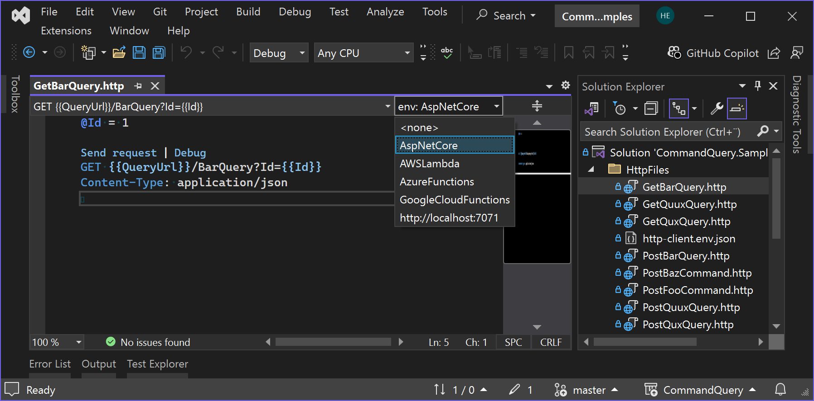

# CommandQuery Sample Code

This code has been written with *Visual Studio 2022*.

The unit tests are using [NUnit](https://github.com/nunit/nunit).

Try out the sample projects via the Postman Workspace:

* <https://www.postman.com/hlaueriksson/workspace/commandquery/overview>

Or via the `.http` files in Visual Studio:

* Open the `CommandQuery.Samples.sln`
* Open a `.http` file in the `HttpFiles` folder
* Select en environment in the HTTP Environments (F6) dropdown:
  * `AspNetCore` | `AWSLambda` | `AzureFunctions` | `GoogleCloudFunctions` | `http://localhost:7071`
* Click the `Send request` link
  * [Send an HTTP request](https://learn.microsoft.com/en-us/aspnet/core/test/http-files?view=aspnetcore-8.0#send-an-http-request)

## Command + Query + Handlers

Sample code:

* `CommandQuery.Sample.Contracts`
* `CommandQuery.Sample.Handlers`

## ASP.NET Core

Sample code:

* `CommandQuery.Sample.AspNetCore`
* `CommandQuery.Sample.AspNetCore.Tests`

## AWS Lambda

Sample code:

* `CommandQuery.Sample.AWSLambda`
* `CommandQuery.Sample.AWSLambda.Tests`

## Azure Functions

Sample code:

* `CommandQuery.Sample.AzureFunctions`
* `CommandQuery.Sample.AzureFunctions.Tests`

## Google Cloud Functions

Sample code:

* `CommandQuery.Sample.GoogleCloudFunctions`
* `CommandQuery.Sample.GoogleCloudFunctions.Tests`

## Client

Sample code:

* `CommandQuery.Sample.Client`
